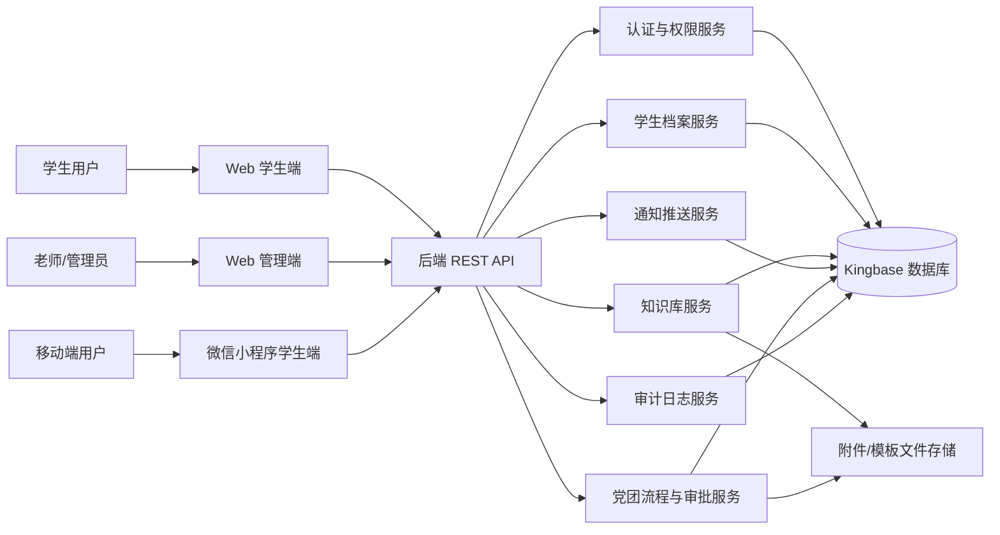
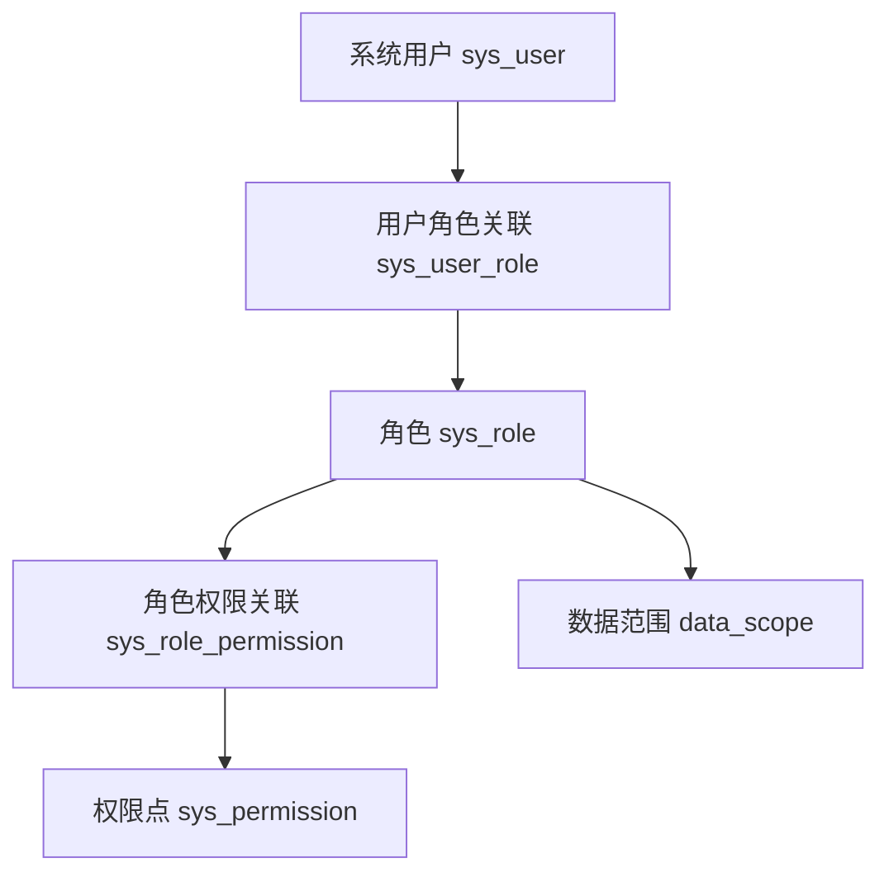
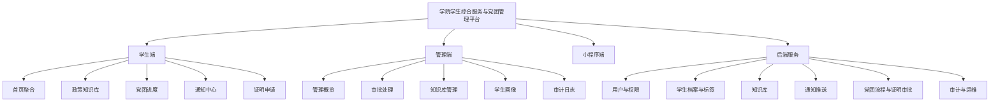
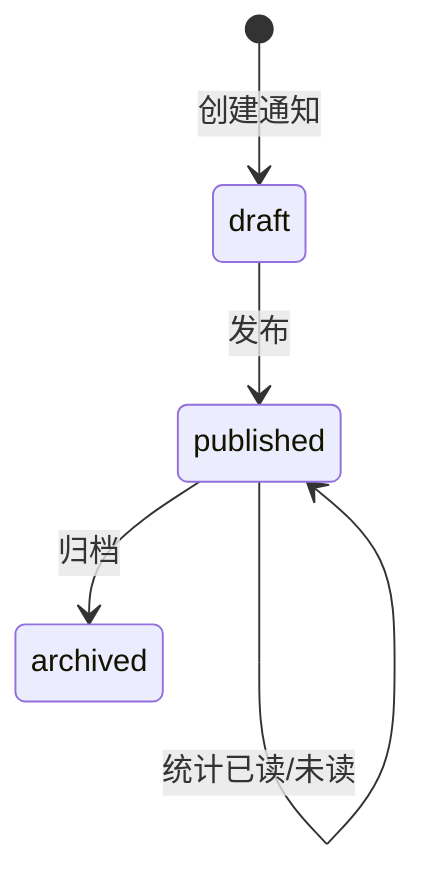
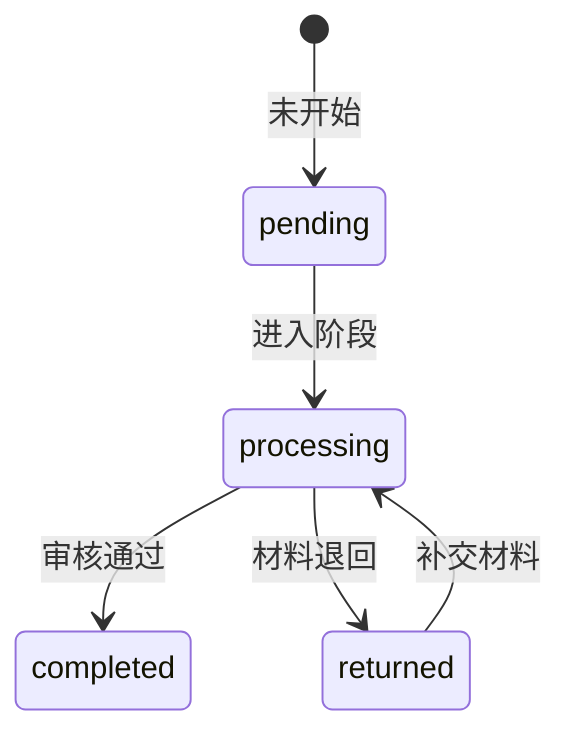
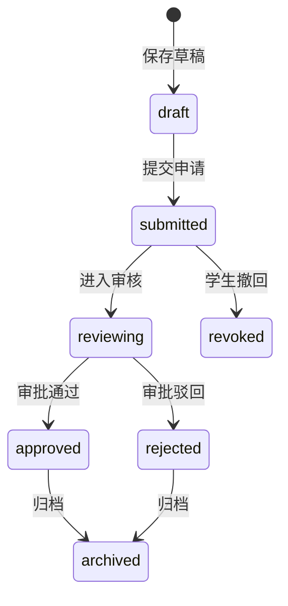

# 学院学生综合服务与党团管理平台软件设计文档

文档编号：ISE-SDS-V1.0  
版本号：V1.0  
编写日期：2026年5月11日  
项目名称：学院学生综合服务与党团管理平台  
开发形式：软件工程导论课程大作业  

## 文档变更历史记录

| 序号 | 变更日期 | 变更人员 | 变更内容详情描述 | 变更后的版本号 |
| --- | --- | --- | --- | --- |
| 1 | 2026-05-11 | 刘凡硕 | 根据项目原型、数据库设计和接口草案填写软件设计文档 | V1.0 |
| 1 | 2026-05-11 | 刘凡硕 | 修复了pdf目录链接问题，但是第1部分的链接还是有问题 | V2.0 |
## 目录

- [1. 引言](#sec-1)
  - [1.1 编写目的](#sec-1-1)
  - [1.2 读者对象](#sec-1-2)
  - [1.3 软件项目概述](#sec-1-3)
  - [1.4 文档概述](#sec-1-4)
  - [1.5 定义](#sec-1-5)
  - [1.6 参考资料](#sec-1-6)
- [2. 软件结构设计](#sec-2)
  - [2.1 软件体系结构设计](#sec-2-1)
  - [2.2 软件功能结构设计](#sec-2-2)
- [3. 软件详细设计](#sec-3)
  - [3.1 用户与权限管理模块设计](#sec-3-1)
  - [3.2 学生档案与标签画像模块设计](#sec-3-2)
  - [3.3 政策知识库模块设计](#sec-3-3)
  - [3.4 通知中心与精准推送模块设计](#sec-3-4)
  - [3.5 党团流程与电子证明审批模块设计](#sec-3-5)
  - [3.6 审计日志与系统维护模块设计](#sec-3-6)

<div style="page-break-before: always; break-before: page;"></div>

<h2 id="sec-1">1. 引言</h2>

<div style="page-break-before: always; break-before: page;"></div>

<h3 id="sec-1-1">1.1 编写目的</h3>

本文档用于说明“学院学生综合服务与党团管理平台”的软件设计方案，明确系统总体架构、功能模块划分、核心数据结构、接口边界、状态流转和安全设计要求，为后续编码实现、测试验证、项目维护提供依据。

本文档重点回答系统“如何实现”的问题，包括学生端、管理端、微信小程序演示端、后端服务、数据库和外部文件交互等设计内容。

<div style="page-break-before: always; break-before: page;"></div>

<h3 id="sec-1-2">1.2 读者对象</h3>

本文档的主要读者包括：

- 项目开发成员：前端、后端、数据库、测试和文档编写人员。
- 课程评审人员：软件工程导论课程教师、助教及评审人员。
- 业务相关人员：学院辅导员、班主任、团委老师、班团骨干等潜在使用者。
- 后续维护人员：后续接手系统扩展、部署或二次开发的学生团队。

<div style="page-break-before: always; break-before: page;"></div>

<h3 id="sec-1-3">1.3 软件项目概述</h3>

| 项目项 | 内容 |
| --- | --- |
| 项目名称 | 学院学生综合服务与党团管理平台 |
| 项目简称 | 学院综合服务平台 |
| 建设目标 | 建设一站式学院学生事务服务入口，实现政策查询、党团流程跟踪、通知推送、证明申请、审批处理和学生画像管理 |
| 使用对象 | 学院本科生、研究生、辅导员、班主任、团委老师、学院领导、系统管理员 |
| 当前实现 | 静态 Web 原型、微信小程序学生端演示、数据库表结构草案、REST API 草案 |
| 运行方式 | Web 原型可直接打开 `index.html`、`student.html`、`admin.html`；小程序端通过微信开发者工具导入 `mini_app` 运行 |
| 数据库约束 | 后续正式后端采用人大金仓 Kingbase，当前 SQL 使用 Kingbase/PostgreSQL 兼容语法描述 |

<div style="page-break-before: always; break-before: page;"></div>

<h3 id="sec-1-4">1.4 文档概述</h3>

本文档共分三章：

- 第一章为引言，说明文档目的、读者、项目概况、术语和参考资料。
- 第二章为软件结构设计，说明系统体系结构、运行环境、分层设计、功能结构和模块关系。
- 第三章为软件详细设计，按模块说明模块职责、输入输出、数据表、接口、页面交互、状态流转和异常处理。

<div style="page-break-before: always; break-before: page;"></div>

<h3 id="sec-1-5">1.5 定义</h3>

| 术语/缩写 | 定义说明 |
| --- | --- |
| 平台 | 指本项目“学院学生综合服务与党团管理平台”。 |
| 学生端 | 面向学生使用的服务入口，用于查询政策、查看通知、查看党团进度和申请证明。 |
| 管理端 | 面向老师和管理员使用的业务管理台，用于审批、维护知识库、推送通知、管理学生画像和查看审计日志。 |
| RBAC | Role-Based Access Control，基于角色的访问控制模型。 |
| 数据范围 | 用户在系统中可访问的数据边界，如本人、本班、本专业、本年级、学院范围和全局范围。 |
| 知识库 | 存放政策文章、FAQ、模板附件和常用办理说明的内容集合。 |
| 精准推送 | 按年级、专业、班级、标签等条件向指定学生群体发布通知。 |
| 党团流程 | 学生入党、入团等组织发展过程中的阶段、材料、审核和提醒记录。 |
| 证明申请 | 学生发起在读证明、成绩证明、党员材料证明等电子证明申请，老师在线审批。 |
| Kingbase | 人大金仓数据库，项目后续正式数据库选型。 |

<div style="page-break-before: always; break-before: page;"></div>

<h3 id="sec-1-6">1.6 参考资料</h3>

| 序号 | 资料名称 | 来源/说明 |
| --- | --- | --- |
| R1 | 《学院学生综合服务与党团管理平台软件需求规格说明书》 | 仓库中的需求规格说明书文档 |
| R2 | `README.md` | 项目说明、原型范围和运行方式 |
| R3 | `docs/architecture.md` | 总体设计草案，包含业务域、核心实体、状态设计和数据范围建议 |
| R4 | `docs/api.md` | 接口文档草案，包含认证、学生档案、知识库、通知、党团流程、证明审批、标签和审计接口 |
| R5 | `database/schema.sql` | 数据库表结构草案 |
| R6 | `student.html`、`admin.html`、`mini_app/` | 已实现的前端页面与微信小程序演示代码 |

<div style="page-break-before: always; break-before: page;"></div>

<h2 id="sec-2">2. 软件结构设计</h2>

<div style="page-break-before: always; break-before: page;"></div>

<h3 id="sec-2-1">2.1 软件体系结构设计</h3>

#### 2.1.1 总体架构

系统采用 B/S 架构，前端以响应式 Web 页面和微信小程序演示端为主要入口，后端规划为 RESTful JSON API 服务，数据库采用 Kingbase。当前仓库中前端原型使用本地模拟数据运行，后续可按接口文档替换为真实后端请求。



#### 2.1.2 分层设计

| 层次 | 主要职责 | 当前项目对应内容 |
| --- | --- | --- |
| 表现层 | 页面展示、表单输入、导航、状态提示、基础交互 | `index.html`、`student.html`、`admin.html`、`styles.css`、`mini_app/pages` |
| 交互逻辑层 | 处理搜索、筛选、已读、申请提交、审批操作等前端交互 | `scripts/app.js`、`mini_app/pages/*/index.js` |
| 接口层 | 对外提供统一 REST API，完成参数校验、鉴权和响应封装 | `docs/api.md` 中定义的 `/api/v1` 接口 |
| 业务服务层 | 处理权限、学生档案、知识库、通知、流程审批、审计等业务规则 | `docs/architecture.md` 中划分的业务域 |
| 数据访问层 | 封装数据库访问、事务控制、分页查询、逻辑删除 | `database/schema.sql` 中的表结构设计 |
| 数据存储层 | 持久化用户、角色、学生、知识库、通知、审批和日志数据 | Kingbase 数据库，附件可使用文件系统或对象存储 |

#### 2.1.3 技术架构

| 类型 | 设计内容 |
| --- | --- |
| 前端 Web | HTML、CSS、JavaScript 静态原型，后续可迁移为 Vue/React 等组件化框架 |
| 微信小程序 | 原生小程序结构，页面包括首页、知识库、党团进度、通知、证明申请 |
| 后端接口 | RESTful JSON API，统一使用 `/api/v1` 路径前缀 |
| 认证方式 | 登录成功后返回 Token，后续请求通过 `Authorization: Bearer <token>` 传递 |
| 数据库 | Kingbase，当前 SQL 采用 Kingbase/PostgreSQL 兼容语法 |
| 主键策略 | 核心表使用 `bigint` 自增主键 |
| 删除策略 | 核心业务表优先采用 `is_deleted` 逻辑删除 |
| 时间格式 | 接口统一使用 `yyyy-MM-dd HH:mm:ss` |
| 响应格式 | `code`、`message`、`data`、`requestId` 四段式统一响应 |

#### 2.1.4 安全与权限设计

系统采用 RBAC 权限模型，权限控制分为账号、角色、权限点和数据范围四层：



数据范围包括：

| 范围值 | 说明 |
| --- | --- |
| `self` | 仅本人数据 |
| `class` | 本班级数据 |
| `major` | 本专业数据 |
| `grade` | 本年级数据 |
| `department` | 学院范围数据 |
| `global` | 全局数据 |

敏感字段包括身份证号、手机号、生源地、家庭经济情况、处分记录、导师信息等。系统设计要求对敏感字段进行最小权限展示、必要脱敏和访问审计。

<div style="page-break-before: always; break-before: page;"></div>

<h3 id="sec-2-2">2.2 软件功能结构设计</h3>

#### 2.2.1 功能结构图



#### 2.2.2 模块划分

| 模块编号 | 模块名称 | 主要职责 | 主要使用者 |
| --- | --- | --- | --- |
| M1 | 用户与权限管理 | 登录、登出、当前用户查询、角色分配、权限校验、数据范围控制 | 学生、老师、管理员 |
| M2 | 学生档案与标签画像 | 学生基础信息、扩展信息、标签维护、画像展示、学籍异动记录 | 老师、管理员、学生 |
| M3 | 政策知识库 | 分类维护、文章检索、文章发布、附件模板管理、热门条目统计 | 学生、老师 |
| M4 | 通知中心与精准推送 | 通知创建、发布范围配置、用户接收记录、已读状态、阅读统计 | 学生、老师 |
| M5 | 党团流程与电子证明审批 | 党团阶段进度、节点记录、证明模板、证明申请、审批通过/驳回/撤回 | 学生、审批老师 |
| M6 | 审计日志与系统维护 | 操作日志记录、敏感访问追踪、系统异常定位、运维查询 | 管理员 |

#### 2.2.3 核心数据表

| 业务域 | 数据表 | 说明 |
| --- | --- | --- |
| 用户与权限 | `sys_user`、`sys_role`、`sys_permission`、`sys_user_role`、`sys_role_permission` | 用户、角色、权限点及关联关系 |
| 学生档案 | `stu_student`、`stu_student_ext`、`stu_tag`、`stu_student_tag`、`stu_change_log` | 学生基础档案、扩展画像、标签和学籍异动 |
| 知识库 | `kb_category`、`kb_article`、`kb_attachment` | 分类、文章和附件 |
| 通知推送 | `msg_notice`、`msg_notice_scope`、`msg_notice_user` | 通知主表、通知范围和用户接收状态 |
| 党团流程 | `flow_party_progress`、`flow_party_record` | 党团当前进度和节点记录 |
| 证明审批 | `cert_template`、`cert_application`、`cert_approval_record` | 证明模板、申请单和审批记录 |
| 审计日志 | `audit_log` | 用户操作、接口请求和审计追踪 |

#### 2.2.4 主要状态设计

| 对象 | 状态 | 说明 |
| --- | --- | --- |
| 学生 | `active`、`graduated`、`suspended`、`withdrawn`、`transferred`、`other_changed` | 在读、毕业、休学、退学、转专业及其他异动 |
| 通知 | `draft`、`published`、`archived` | 草稿、已发布、已归档 |
| 通知阅读 | `unread`、`read` | 未读、已读 |
| 党团节点 | `pending`、`processing`、`completed`、`returned` | 未开始、进行中、已完成、已退回 |
| 证明申请 | `draft`、`submitted`、`reviewing`、`approved`、`rejected`、`revoked`、`archived` | 草稿、已提交、审核中、已通过、已驳回、已撤回、已归档 |

<div style="page-break-before: always; break-before: page;"></div>

<h2 id="sec-3">3. 软件详细设计</h2>

<div style="page-break-before: always; break-before: page;"></div>

<h3 id="sec-3-1">3.1 用户与权限管理模块设计</h3>

#### 3.1.1 模块职责

用户与权限管理模块负责系统登录身份识别、用户会话维护、角色权限校验和数据范围控制。学生通常使用学号登录并关联一条学生档案；老师和管理员使用工号或后台账号登录，并通过角色获得管理端菜单和数据访问范围。

#### 3.1.2 功能设计

| 功能 | 输入 | 处理 | 输出 |
| --- | --- | --- | --- |
| 用户登录 | 用户名、密码 | 校验账号状态和密码，生成 Token，加载角色与数据范围 | Token、用户信息、角色列表 |
| 当前用户查询 | Token | 解析登录态，查询用户基础信息与权限 | 当前用户信息 |
| 登出 | Token | 清理会话或使 Token 失效 | 操作结果 |
| 权限校验 | 用户、接口路径、操作类型 | 根据角色权限点判断是否允许访问 | 允许或拒绝 |
| 数据范围过滤 | 用户角色、业务查询条件 | 按 `self`、`class`、`major`、`grade` 等范围补充查询条件 | 过滤后的数据 |

#### 3.1.3 数据库设计

| 表名 | 关键字段 | 说明 |
| --- | --- | --- |
| `sys_user` | `username`、`password_hash`、`real_name`、`user_type`、`student_id`、`status` | 存储系统用户和登录账号 |
| `sys_role` | `role_code`、`role_name`、`data_scope` | 存储角色和默认数据范围 |
| `sys_permission` | `permission_code`、`permission_type`、`path`、`method` | 存储菜单、按钮、接口权限点 |
| `sys_user_role` | `user_id`、`role_id` | 用户与角色多对多关联 |
| `sys_role_permission` | `role_id`、`permission_id` | 角色与权限点多对多关联 |

#### 3.1.4 接口设计

| 接口 | 方法 | 说明 |
| --- | --- | --- |
| `/api/v1/auth/login` | POST | 用户登录 |
| `/api/v1/auth/me` | GET | 获取当前登录用户 |
| `/api/v1/auth/logout` | POST | 退出登录 |

统一登录响应示例：

```json
{
  "code": 0,
  "message": "ok",
  "data": {
    "token": "jwt-token-demo",
    "user": {
      "id": 1,
      "username": "20220001",
      "realName": "赵晨曦",
      "userType": "student",
      "roles": ["student"]
    }
  },
  "requestId": "202605111200001234"
}
```

#### 3.1.5 异常处理

| 异常 | 处理方式 |
| --- | --- |
| 用户名或密码错误 | 返回 `40100`，提示账号或密码错误 |
| 用户被禁用 | 返回 `40300`，提示账号不可用 |
| Token 失效 | 返回 `40100`，前端跳转登录页 |
| 越权访问 | 返回 `40300`，记录审计日志 |

<div style="page-break-before: always; break-before: page;"></div>

<h3 id="sec-3-2">3.2 学生档案与标签画像模块设计</h3>

#### 3.2.1 模块职责

学生档案与标签画像模块负责维护学院学生基础信息、扩展信息、标签信息和学籍异动记录。学生端展示本人画像，管理端支持按年级、专业、班级、状态、标签等条件筛选学生，为精准通知和业务统计提供数据基础。

#### 3.2.2 功能设计

| 功能 | 说明 |
| --- | --- |
| 当前学生画像 | 学生登录后查看本人基本信息、标签、党团阶段、未读通知数和待办数 |
| 学生列表查询 | 管理端按姓名、学号、年级、专业、班级、状态、标签分页检索 |
| 学生详情查询 | 查看学生基础信息、扩展画像、党团流程、证明申请和通知记录 |
| 标签维护 | 管理员新建标签，并为学生绑定或移除标签 |
| 学籍异动记录 | 记录毕业、休学、退学、转专业等状态变化，保留历史 |

#### 3.2.3 数据库设计

| 表名 | 关键字段 | 说明 |
| --- | --- | --- |
| `stu_student` | `student_no`、`name`、`grade`、`major`、`class_name`、`status` | 学生基础档案 |
| `stu_student_ext` | `student_id`、`native_place`、`dormitory`、`tutor_name`、`family_economic_level` | 学生扩展信息 |
| `stu_tag` | `tag_code`、`tag_name`、`tag_type` | 标签定义 |
| `stu_student_tag` | `student_id`、`tag_id` | 学生和标签关联 |
| `stu_change_log` | `student_id`、`change_type`、`before_status`、`after_status`、`change_date` | 学籍异动记录 |

#### 3.2.4 接口设计

| 接口 | 方法 | 说明 |
| --- | --- | --- |
| `/api/v1/students/me/profile` | GET | 获取当前学生画像 |
| `/api/v1/students` | GET | 学生列表分页查询 |
| `/api/v1/students/{studentId}` | GET | 学生详情 |
| `/api/v1/students/{studentId}/tags` | PUT | 更新学生标签 |
| `/api/v1/tags` | GET | 标签列表 |
| `/api/v1/tags` | POST | 新建标签 |

#### 3.2.5 页面设计

学生端首页的“我的画像”区域展示年级、专业、党员发展对象、奖学金关注、就业意向等标签，并展示班级、辅导员、培养状态。管理端“学生画像与标签”页面展示就业意向人群、党员发展对象、学业预警关注等群体分段，用于老师快速识别目标对象。

#### 3.2.6 安全设计

- 普通学生只能访问本人档案。
- 班主任默认只能访问本班学生。
- 辅导员和团委老师按职责范围访问年级、专业或支部数据。
- 身份证号、手机号、家庭经济情况等敏感字段应脱敏展示。
- 敏感字段访问、批量导出和标签批量修改必须写入审计日志。

<div style="page-break-before: always; break-before: page;"></div>

<h3 id="sec-3-3">3.3 政策知识库模块设计</h3>

#### 3.3.1 模块职责

政策知识库模块负责管理学院学生事务相关政策文章、FAQ、材料模板和附件。学生端支持关键词检索和分类筛选，管理端支持条目维护和发布，为奖助、学籍、党团、证明等高频咨询场景提供统一入口。

#### 3.3.2 功能设计

| 功能 | 说明 |
| --- | --- |
| 分类查询 | 查询奖助、学籍、党团、证明等知识库分类 |
| 文章检索 | 根据关键词、分类、发布状态分页查询文章 |
| 文章详情 | 查看标题、摘要、正文、关键词、附件和来源 |
| 创建文章 | 老师或管理员新增知识库条目 |
| 发布文章 | 草稿确认后发布给学生端查看 |
| 附件管理 | 上传证明模板、材料清单、政策原文等附件 |

#### 3.3.3 数据库设计

| 表名 | 关键字段 | 说明 |
| --- | --- | --- |
| `kb_category` | `category_name`、`parent_id`、`sort_no` | 知识库分类 |
| `kb_article` | `category_id`、`title`、`summary`、`content`、`keywords`、`publish_status`、`view_count` | 知识库文章 |
| `kb_attachment` | `article_id`、`file_name`、`file_url`、`file_size` | 文章附件 |

#### 3.3.4 接口设计

| 接口 | 方法 | 说明 |
| --- | --- | --- |
| `/api/v1/kb/categories` | GET | 分类列表 |
| `/api/v1/kb/articles` | GET | 文章分页查询 |
| `/api/v1/kb/articles/{articleId}` | GET | 文章详情 |
| `/api/v1/kb/articles` | POST | 创建文章 |
| `/api/v1/kb/articles/{articleId}/publish` | POST | 发布文章 |

#### 3.3.5 前端交互设计

学生端“政策知识库”页面提供搜索框和分类下拉框，用户输入“奖学金、复学、党员发展、证明模板”等关键词后，前端根据标题、摘要和关键词进行匹配。当前原型中的知识库示例包括：

| 分类 | 示例条目 | 说明 |
| --- | --- | --- |
| 奖助 | 国家奖学金评定流程说明 | 申请资格、名额分配、材料清单和公示流程 |
| 学籍 | 休学与复学办理指南 | 休学申请条件、复学材料和学院审核路径 |
| 党团 | 党员发展阶段材料清单 | 各阶段所需材料 |
| 证明 | 在读证明与成绩证明模板下载 | 常用证明模板和线上审批说明 |

管理端“知识库管理”页面展示知识库条目列表，并预留“新增条目”操作。

#### 3.3.6 异常处理

| 异常 | 处理方式 |
| --- | --- |
| 搜索结果为空 | 前端提示“未找到匹配条目” |
| 文章不存在或已删除 | 返回 `40400` |
| 未发布文章被学生访问 | 返回 `40300` 或 `40400` |
| 附件过大或格式不允许 | 返回 `40001` 并提示上传限制 |

<div style="page-break-before: always; break-before: page;"></div>

<h3 id="sec-3-4">3.4 通知中心与精准推送模块设计</h3>

#### 3.4.1 模块职责

通知中心与精准推送模块负责老师面向学生发布公告、定向通知和待办提醒。系统支持按年级、专业、班级、标签等条件圈定接收范围，并为每个用户生成接收记录，便于统计已读和未读状态。

#### 3.4.2 功能设计

| 功能 | 说明 |
| --- | --- |
| 创建通知 | 管理端填写标题、正文、通知类型、发布时间和接收范围 |
| 通知发布 | 根据范围生成用户接收记录 |
| 我的通知 | 学生端查看本人接收的通知列表 |
| 标记已读 | 学生可对单条通知标记已读 |
| 全部已读 | 学生可将所有未读通知标记为已读 |
| 阅读统计 | 管理端查看通知送达和阅读情况 |

#### 3.4.3 数据库设计

| 表名 | 关键字段 | 说明 |
| --- | --- | --- |
| `msg_notice` | `title`、`content`、`notice_type`、`status`、`publish_at`、`created_by` | 通知主表 |
| `msg_notice_scope` | `notice_id`、`scope_type`、`scope_value` | 通知发布范围 |
| `msg_notice_user` | `notice_id`、`user_id`、`read_status`、`read_at`、`delivery_status` | 用户接收和阅读状态 |

#### 3.4.4 接口设计

| 接口 | 方法 | 说明 |
| --- | --- | --- |
| `/api/v1/notices/my` | GET | 当前用户通知分页 |
| `/api/v1/notices/{noticeId}/read` | POST | 标记单条通知已读 |
| `/api/v1/notices/read-all` | POST | 全部标记已读 |
| `/api/v1/notices` | POST | 创建通知 |
| `/api/v1/notices` | GET | 通知管理分页 |

#### 3.4.5 状态流转



通知发布后，系统为接收用户生成 `msg_notice_user` 记录，初始阅读状态为 `unread`。用户点击“标记已读”后，状态更新为 `read`，并记录 `read_at`。

#### 3.4.6 当前原型设计

学生端首页展示未读通知数量和近期通知；通知中心页面支持单条标记已读和全部标记已读。管理端概览展示“今日推送”指标，后续可扩展到通知创建和阅读统计页面。

<div style="page-break-before: always; break-before: page;"></div>

<h3 id="sec-3-5">3.5 党团流程与电子证明审批模块设计</h3>

#### 3.5.1 模块职责

本模块包含两个关联但独立的业务能力：党团流程跟踪和电子证明审批。党团流程用于记录学生在申请人、积极分子、发展对象、预备党员、正式党员等阶段的进度；电子证明审批用于处理在读证明、成绩证明、党员材料证明等申请。

#### 3.5.2 党团流程功能设计

| 功能 | 说明 |
| --- | --- |
| 当前进度查询 | 学生查看本人党团当前阶段和节点状态 |
| 指定学生进度查询 | 老师查看指定学生党团进度 |
| 更新当前阶段 | 老师更新学生当前阶段和处理状态 |
| 新增节点记录 | 记录材料提交、审核意见、完成时间和退回原因 |
| 待补材料提醒 | 对缺失思想汇报、志愿服务记录等材料进行提醒 |

党团节点状态流转如下：



#### 3.5.3 证明审批功能设计

| 功能 | 说明 |
| --- | --- |
| 模板列表 | 学生选择在读证明、成绩证明等模板 |
| 发起申请 | 填写用途说明和补充信息后提交 |
| 我的申请 | 学生查看本人申请记录和状态 |
| 撤回申请 | 学生在允许阶段撤回申请 |
| 待审批列表 | 老师查看待审批证明申请 |
| 审批通过 | 审批人填写意见并通过申请 |
| 审批驳回 | 审批人填写原因并驳回申请 |

证明申请状态流转如下：



#### 3.5.4 数据库设计

| 表名 | 关键字段 | 说明 |
| --- | --- | --- |
| `flow_party_progress` | `student_id`、`current_stage`、`current_status`、`branch_name`、`owner_user_id` | 学生党团当前进度 |
| `flow_party_record` | `progress_id`、`stage_name`、`stage_order`、`status`、`reviewer_user_id`、`review_comment` | 党团节点记录 |
| `cert_template` | `template_code`、`template_name`、`template_type`、`template_content`、`status` | 证明模板 |
| `cert_application` | `application_no`、`template_id`、`student_id`、`purpose`、`status`、`current_approver_id` | 证明申请单 |
| `cert_approval_record` | `application_id`、`approver_user_id`、`action_type`、`action_comment`、`action_time` | 审批记录 |

#### 3.5.5 接口设计

| 接口 | 方法 | 说明 |
| --- | --- | --- |
| `/api/v1/party-progress/me` | GET | 获取当前学生党团进度 |
| `/api/v1/party-progress/{studentId}` | GET | 获取指定学生党团进度 |
| `/api/v1/party-progress/{studentId}` | PUT | 更新党团当前阶段 |
| `/api/v1/party-progress/{studentId}/records` | POST | 新增节点记录 |
| `/api/v1/certificates/templates` | GET | 证明模板列表 |
| `/api/v1/certificates/applications` | POST | 发起证明申请 |
| `/api/v1/certificates/applications/my` | GET | 我的证明申请列表 |
| `/api/v1/certificates/applications/{applicationId}` | GET | 证明申请详情 |
| `/api/v1/certificates/applications/{applicationId}/revoke` | POST | 撤回证明申请 |
| `/api/v1/certificates/approvals/pending` | GET | 待审批列表 |
| `/api/v1/certificates/applications/{applicationId}/approve` | POST | 审批通过 |
| `/api/v1/certificates/applications/{applicationId}/reject` | POST | 审批驳回 |

#### 3.5.6 页面设计

学生端“党团事务进度”页面以时间线展示申请人、积极分子、发展对象、预备党员、正式党员等阶段，并在当前节点显示材料补交提醒。学生端“证明申请”页面包含证明类型、用途说明、补充说明和提交按钮，同时展示我的申请记录。

管理端“审批处理”页面展示待审批事项，包含申请人、申请类型、优先级、状态和详情说明。老师可在正式版本中进行通过、驳回和补正操作。

#### 3.5.7 一致性设计

- 证明申请状态变更与审批记录写入应在同一事务内完成。
- 审批通过或驳回后应生成通知提醒申请学生。
- 同一申请单在终态下不得重复审批。
- 党团流程节点退回后必须保留历史审核意见，不覆盖原记录。

<div style="page-break-before: always; break-before: page;"></div>

<h3 id="sec-3-6">3.6 审计日志与系统维护模块设计</h3>

#### 3.6.1 模块职责

审计日志与系统维护模块用于记录关键操作、敏感数据访问、导入导出、权限变更和接口异常，为安全追踪、问题定位和责任界定提供依据。

#### 3.6.2 功能设计

| 功能 | 说明 |
| --- | --- |
| 操作日志记录 | 记录用户、模块、动作、目标对象、请求路径、结果和时间 |
| 敏感访问审计 | 对查看联系方式、身份证号、家庭经济情况等敏感字段的行为留痕 |
| 权限变更审计 | 记录角色新增、权限调整、数据范围变更等操作 |
| 导入导出审计 | 记录学生名单导入、奖学金候选名单导出等批量操作 |
| 日志分页查询 | 管理员按用户、模块、动作和时间范围查询日志 |

#### 3.6.3 数据库设计

| 表名 | 关键字段 | 说明 |
| --- | --- | --- |
| `audit_log` | `user_id`、`module_code`、`action_code`、`target_type`、`target_id`、`request_method`、`request_path`、`request_ip`、`result_code`、`result_message`、`created_at` | 审计日志主表 |

#### 3.6.4 接口设计

| 接口 | 方法 | 说明 |
| --- | --- | --- |
| `/api/v1/audit-logs` | GET | 审计日志分页查询 |
| `/api/v1/dashboard/student` | GET | 学生端首页聚合接口 |
| `/api/v1/dashboard/admin` | GET | 管理端首页聚合接口 |

#### 3.6.5 当前原型设计

管理端“审计日志”页面展示以下类型的日志示例：

- 辅导员导出 2022 级奖学金候选名单。
- 超级管理员调整角色权限，新增证明审批菜单。
- 辅导员查看学生敏感字段联系方式。

管理端首页聚合展示学生总数、待审批数、今日推送数、风险预警数、知识库条目数、党团流程进行中人数和证明申请处理中数量。

#### 3.6.6 系统错误码设计

| 错误码 | 含义 |
| --- | --- |
| `0` | 成功 |
| `40001` | 参数校验失败 |
| `40100` | 未登录或 Token 无效 |
| `40300` | 无权限访问 |
| `40400` | 资源不存在 |
| `40900` | 状态冲突 |
| `50000` | 系统内部错误 |

#### 3.6.7 可维护性设计

- 模块之间通过接口和数据库实体解耦，知识库、通知、审批、学生画像可独立扩展。
- 业务状态使用明确枚举值，便于前后端统一判断。
- 核心业务表保留 `created_at`、`updated_at`、`is_deleted` 等通用字段，便于追踪和逻辑删除。
- 高频查询字段建立索引，如学生年级专业班级、知识库分类状态、通知发布时间、申请人状态、审批人状态、日志用户时间等。
- 后续可扩展文件导入导出、微信实名登录、短信通道、通用工作流引擎和成绩单自动解析能力。
