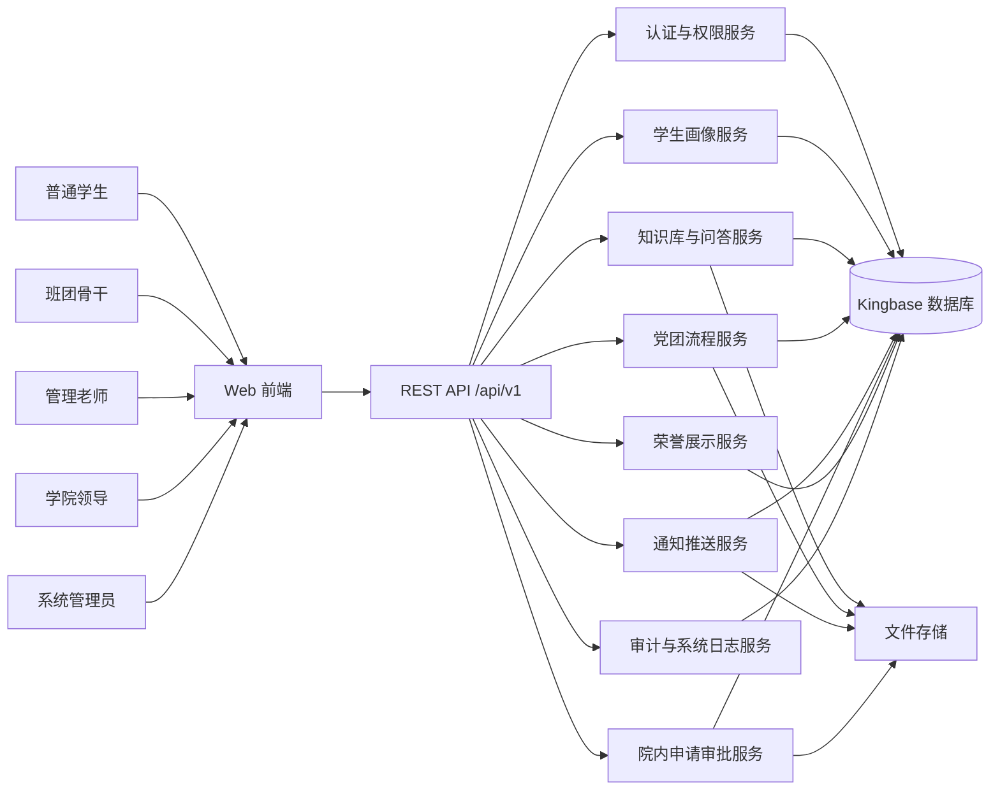
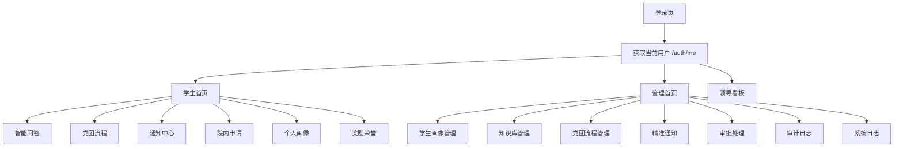
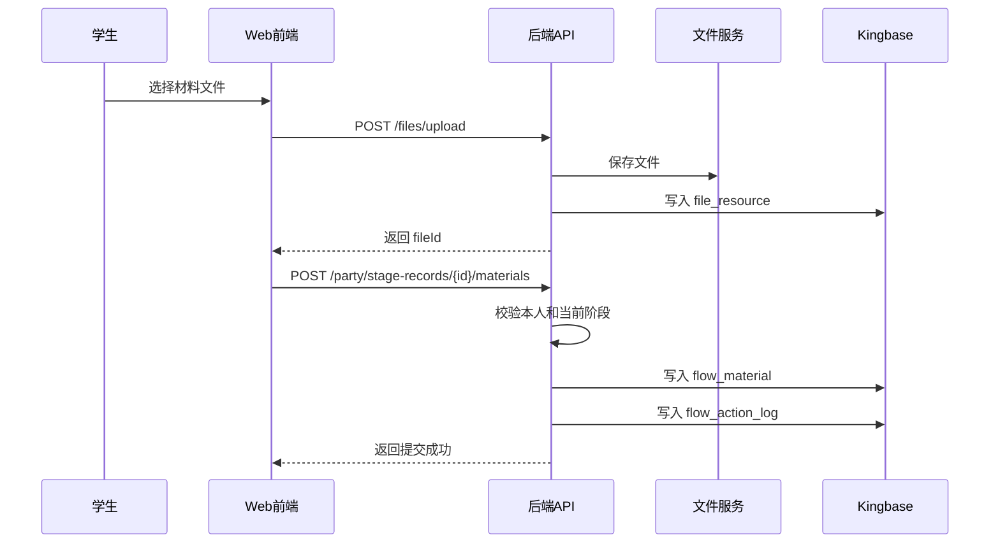
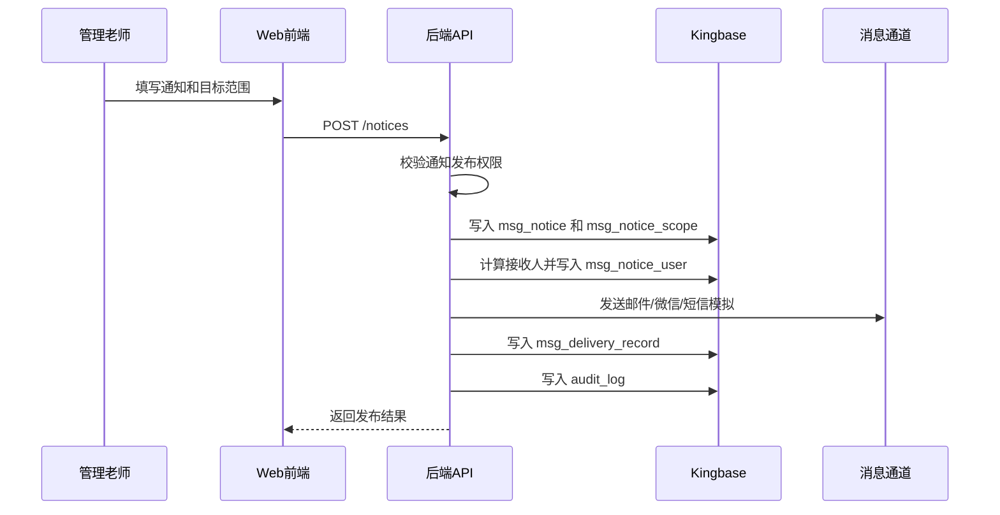
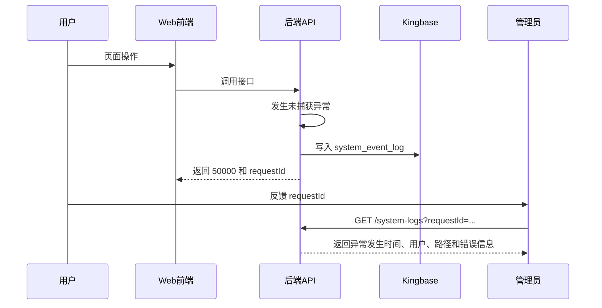
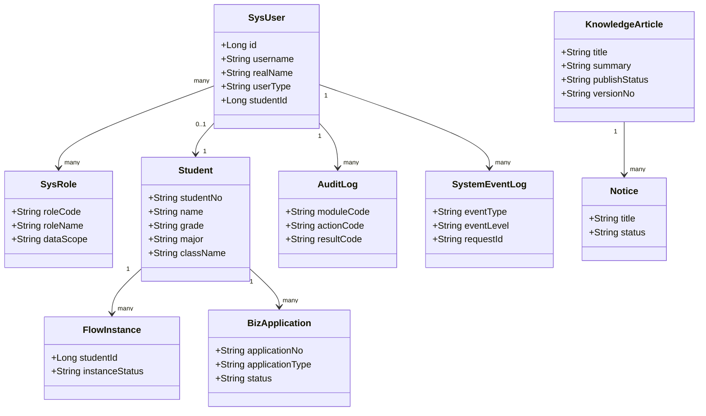
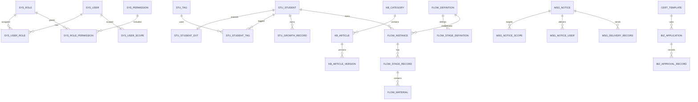
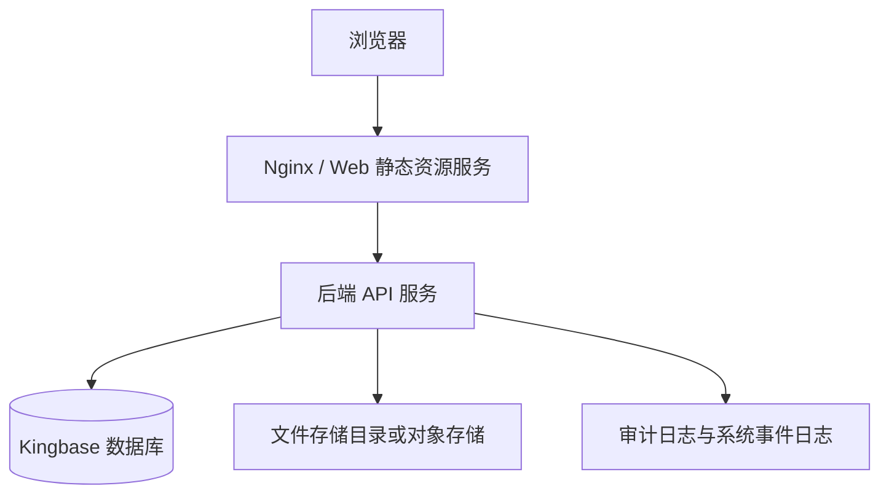

# 学院学生综合服务与党团管理平台 软件设计规格说明书

文档编号：学院学生综合服务与党团管理平台-SDS-V3.0  
项目名称：学院学生综合服务与党团管理平台  
文档名称：软件设计规格说明书  
版本：V3.0  
日期：2026/5/11  

## 文档变更历史记录

| 序号 | 变更日期 | 变更人员 | 变更内容详情描述 | 版本 |
| --- | --- | --- | --- | --- |
| 1 | 2026/5/11 | 刘凡硕 | 根据项目原型、数据库设计和接口文档填写软件设计文档 | V1.0 |
| 2 | 2026/5/11 | 刘凡硕 | 修复 PDF 目录链接问题 | V2.0 |
| 3 | 2026/5/11 | OpenAI | 以 `软件设计文档.doc` 为模板，结合甲方需求、docs 文档和数据库设计重写 | V3.0 |

## 目录

- [1、引言](#1引言)
  - [1.1 编写目的](#11-编写目的)
  - [1.2 读者对象](#12-读者对象)
  - [1.3 软件项目概述](#13-软件项目概述)
  - [1.4 文档概述](#14-文档概述)
  - [1.5 定义](#15-定义)
  - [1.6 参考资料](#16-参考资料)
- [2、软件设计约束](#2软件设计约束)
  - [2.1 软件设计目标和原则](#21-软件设计目标和原则)
  - [2.2 软件设计的约束和限制](#22-软件设计的约束和限制)
- [3、软件设计](#3软件设计)
  - [3.1 软件体系结构设计](#31-软件体系结构设计)
  - [3.2 用户界面设计](#32-用户界面设计)
  - [3.3 用例设计](#33-用例设计)
  - [3.4 类设计](#34-类设计)
  - [3.5 数据设计](#35-数据设计)
  - [3.6 部署设计](#36-部署设计)

## 1、引言

### 1.1 编写目的

本文档用于描述“学院学生综合服务与党团管理平台”的软件设计方案，说明系统在正式 Web 网站形态下的总体架构、模块划分、页面设计、用例实现、核心类与服务、数据库模型和部署方案。

本文档承接需求文档，并结合仓库中已经整理的 `docs/architecture.md`、`docs/api.md`、`docs/database.md`、`docs/frontend-spec.md`、`docs/role-permission.md`、`docs/dictionary.md` 和 `database/schema.sql`，为前端、后端、测试和后续维护人员提供统一设计依据。

### 1.2 读者对象

本文档的主要读者包括：

- 前端开发人员：根据用户界面设计、路由结构、接口约定和权限要求开发 Web 页面。
- 后端开发人员：根据体系结构、用例设计、类设计、接口设计和日志设计开发服务端。
- 数据库开发人员：根据数据设计和 `database/schema.sql` 建立 Kingbase 数据库。
- 测试人员：根据用例、权限、状态流转和异常处理要求设计测试用例。
- 项目设计人员与评审人员：确认系统设计是否覆盖甲方需求和课程项目交付要求。

### 1.3 软件项目概述

| 项目项 | 内容 |
| --- | --- |
| 项目名称 | 学院学生综合服务与党团管理平台 |
| 项目简称 | 学院综合服务平台 |
| 用户单位 | 学院学生工作与党团事务相关管理部门 |
| 开发单位 | 课程项目开发小组 |
| 产品形态 | 前后端分离 Web 网站 |
| 目标用户 | 普通学生、班团骨干、管理老师、学院领导、系统管理员 |
| 用户规模 | 学院约 1200 名本科生及研究生 |
| 数据库 | 人大金仓 Kingbase |
| 建设目标 | 建设一站式学院学生服务窗口，实现事务办理线上化、政策咨询智能化、党团流程可视化、通知推送精准化、学生数据规范化和操作可追溯 |

项目一期不直接对接校级“微人大”等外部系统，学生信息、政策文件、证明模板、通知附件等数据主要通过后台维护、Excel/Word/PDF 导入导出和文件上传下载完成。

### 1.4 文档概述

本文档按照模板分为三章：

- 第 1 章为引言，说明编写目的、读者对象、项目概况、文档组织、术语定义和参考资料。
- 第 2 章为软件设计约束，说明设计目标、设计原则、运行环境、开发技术、性能容量、安全权限和日志追踪等约束。
- 第 3 章为软件设计，说明软件体系结构、用户界面、用例、类、数据和部署设计。

### 1.5 定义

| 术语/缩写 | 定义说明 |
| --- | --- |
| 平台 | 指本项目“学院学生综合服务与党团管理平台”。 |
| 学生端 | 面向普通学生和班团骨干的 Web 使用入口。 |
| 管理端 | 面向管理老师、学院领导和系统管理员的 Web 业务管理台。 |
| RBAC | Role-Based Access Control，基于角色的访问控制模型。 |
| 数据范围 | 用户可访问的数据边界，如本人、班级、支部、专业、年级、学院、全局。 |
| 知识库 | 由政策文件、标准答案、知识条目、模板附件和问答来源构成的内容集合。 |
| 党团流程 | 入党、入团等固定线性流程中的阶段、材料、审核、提醒和留痕。 |
| 院内申请 | 证明、请假、盖章等学院内部申请事项。 |
| 审计日志 | 记录业务操作责任，用于追踪谁在什么时候做了什么。 |
| 系统事件日志 | 记录系统事件、接口异常、任务失败和前端报错，用于定位平台问题。 |
| Kingbase | 人大金仓数据库，本项目正式数据库选型。 |

### 1.6 参考资料

| 序号 | 资料名称 | 来源/说明 |
| --- | --- | --- |
| R1 | 《学院学生综合服务与党团管理平台-需求描述完善版.docx》 | 甲方完整需求文档 |
| R2 | `README.md` | 项目需求概要、交接说明和运行方式 |
| R3 | `docs/architecture.md` | 总体架构、业务域和技术边界 |
| R4 | `docs/api.md` | REST API 接口契约 |
| R5 | `docs/database.md` | 数据库设计说明 |
| R6 | `docs/frontend-spec.md` | Web 前端路由、页面和交互说明 |
| R7 | `docs/role-permission.md` | 角色权限矩阵 |
| R8 | `docs/dictionary.md` | 枚举字典和错误码 |
| R9 | `database/schema.sql` | Kingbase/PostgreSQL 兼容建表脚本 |
| R10 | `软件设计文档.doc` | 本文档采用的软件设计规格说明书模板 |

## 2、软件设计约束

### 2.1 软件设计目标和原则

#### 2.1.1 软件设计目标

| 目标 | 说明 |
| --- | --- |
| 满足甲方核心需求 | 覆盖智能问答、党团流程、学生画像、奖励荣誉、精准通知、院内申请审批和日志追踪。 |
| 支持学院内部实际使用 | 面向约 1200 名学生及学院管理人员，适配学生端高频办理和管理端批量处理。 |
| 保证权限与数据安全 | 通过 RBAC、数据范围、对象归属校验、敏感字段脱敏和日志审计防止越权。 |
| 保证业务可追溯 | 党团流程、审批、通知、敏感字段访问、导入导出均需留痕。 |
| 支持问题定位 | 通过系统事件日志记录异常发生时间、操作人员、请求编号、接口路径和错误信息。 |
| 支持后续扩展 | 学业预警、理论自测、更多院内申请场景和外部系统对接作为扩展能力预留。 |

#### 2.1.2 软件设计原则

- 抽象与逐步求精原则：先从用户管理、学生画像、知识库、党团流程、通知、申请审批、荣誉管理和日志追踪等高层业务抽象出发，明确模块职责、核心数据和主要流程，再逐步细化到接口、状态、权限、字段和异常处理规则。
- 模块化、高内聚度、低耦合度原则：按照业务域和职责边界拆分系统模块，使同一模块内部围绕单一业务目标组织功能，不同模块之间通过清晰接口协作，减少对内部实现细节的依赖。
- 信息隐藏原则：各模块只暴露必要的数据结构、服务接口和交互契约，权限规则、数据范围、对象归属校验、敏感字段脱敏、状态流转等实现细节由对应模块内部封装，避免被其他模块直接依赖或绕过。
- 多视点和关注点分离原则：分别从学生用户、学院管理人员、系统管理员和审计监管等视点分析系统需求，并将界面交互、业务规则、权限控制、数据持久化、日志审计和异常处理等关注点分离设计。
- 软件重用原则：对 RBAC 权限控制、通知发送、文件上传、字典枚举、分页查询、审计日志、系统事件日志和通用审批流程等共性能力进行统一设计和复用，减少重复实现。
- 迭代设计原则：以 P0/P1 核心功能作为一期建设重点，优先满足智能问答、党团流程、学生画像、精准通知、申请审批和日志追踪等主要需求，再根据使用反馈逐步完善 P2 学业预警、理论自测和外部系统对接能力。
- 可追踪性原则：在需求、设计、接口、数据字典、测试用例和业务操作记录之间建立对应关系，关键业务操作写审计日志，系统异常写系统事件日志，保证需求实现、问题定位和责任追溯有据可查。

### 2.2 软件设计的约束和限制

#### 2.2.1 运行环境要求

| 类型 | 约束 |
| --- | --- |
| 客户端 | 主流现代浏览器，学生端需适配手机浏览器，管理端以 PC 浏览器为主。 |
| 服务端 | 部署在学院或合作单位提供的服务器环境中。 |
| 数据库 | 人大金仓 Kingbase。 |
| 文件存储 | 支持 PDF、Word、Excel 等附件、模板和导入导出文件。 |
| 网络环境 | 学院内部网络或授权访问环境。 |

#### 2.2.2 开发语言约束

| 开发对象 | 开发语言说明 |
| --- | --- |
| 前端页面 | 使用 HTML、CSS 和 JavaScript/TypeScript 开发浏览器端页面与交互逻辑。 |
| 后端服务 | 使用 Java、Python、Go 或 Node.js 等主流后端开发语言实现业务服务和 RESTful API，具体语言应结合学院部署环境、团队技术能力和后续维护成本确定。 |
| 数据库脚本 | 使用 SQL 编写数据库建表、查询、统计和数据维护脚本，语法应兼容人大金仓 Kingbase。 |
| 配置与接口数据 | 使用 JSON 或 YAML 描述系统配置、接口请求响应示例、枚举字典和外部集成参数。 |
| 文档与说明 | 使用 Markdown 编写需求说明、接口说明、数据库说明、开发记录和部署说明。 |

#### 2.2.3 开发工具约束

| 工具类别 | 工具说明 |
| --- | --- |
| 代码编辑工具 | 前端、后端和文档开发可使用 Visual Studio Code、IntelliJ IDEA、WebStorm、PyCharm 等主流开发工具。 |
| 版本管理工具 | 使用 Git 进行代码版本管理，代码仓库应保存源代码、数据库脚本、接口文档和部署说明。 |
| 接口调试工具 | 使用 Apifox、Postman 或类似工具进行 RESTful API 调试、接口用例维护和联调验证。 |
| 数据库管理工具 | 使用 KingbaseES 数据库管理工具、DBeaver 或 Navicat 等工具进行数据库连接、表结构查看、SQL 调试和数据维护。 |
| 浏览器调试工具 | 使用 Chrome、Edge 等现代浏览器及其开发者工具进行页面调试、网络请求检查和兼容性验证。 |
| 文档编写工具 | 使用 Markdown 编辑器、在线协作文档或项目仓库中的文档文件维护需求、设计、接口和数据库说明。 |

#### 2.2.4 标准规范约束

- 接口统一响应格式包含 `code`、`message`、`data`、`requestId`。
- 时间格式统一为 `yyyy-MM-dd HH:mm:ss`。
- 日期格式统一为 `yyyy-MM-dd`。
- 分页参数统一为 `pageNo`、`pageSize`，`pageNo` 从 1 开始。
- 核心业务表使用逻辑删除字段 `is_deleted`。
- 枚举字段使用英文 `value`，页面展示使用中文 `label`。

#### 2.2.5 容量和性能要求

| 类别 | 要求 |
| --- | --- |
| 用户规模 | 支持学院约 1200 名学生及多角色管理人员使用。 |
| 并发场景 | 通知发布、材料集中提交、批量导入导出时保持稳定。 |
| 响应要求 | 首页聚合、通知列表、知识库检索等高频接口应具备分页或聚合优化。 |
| 文件限制 | 政策文件建议单文件不超过 30MB。 |
| 日志检索 | 审计日志和系统日志需支持按时间、人员、模块、requestId 查询。 |

#### 2.2.6 灵活性和配置要求

- 系统应支持通过配置方式调整常用业务参数，减少因规则微调导致的代码修改。
- 用户角色、菜单入口、功能权限和数据访问范围应支持按管理要求灵活设置。
- 通知类型、知识库分类、申请类型、荣誉类别、流程状态等基础字典应集中维护，保证前后端使用一致。
- 审批流程、材料清单、表单字段和消息模板应具备一定配置能力，以适应学院业务流程变化。
- 系统应预留模块扩展接口，后续新增业务功能时应尽量复用已有认证、权限、日志、文件和通知能力。
- 系统配置应区分开发、测试和正式运行环境，数据库连接、文件存储路径、接口地址等环境参数不得写死在业务代码中。

#### 2.2.7 设计限制

- 一期不直接对接校级“微人大”等外部系统。
- 一期不实现正式短信发送，只保留短信模拟发送记录。
- 一期不建设通用 BPM 引擎，党团流程和院内申请按轻量流程模型实现。
- 一期不实现成绩单自动解析主流程。
- 助教或临时协助人员原则上不开放正式审批权限。

## 3、软件设计

### 3.1 软件体系结构设计

#### 3.1.1 总体体系结构

系统采用 B/S 架构。浏览器端提供学生端、管理端和领导端页面；后端提供 REST API；数据库使用 Kingbase；文件统一进入文件资源索引；日志分为业务审计日志和系统事件日志。



#### 3.1.2 分层结构

| 层次 | 职责 | 主要内容 |
| --- | --- | --- |
| 表现层 | 页面展示、表单输入、导航、状态提示 | 登录页、学生端、管理端、领导端 |
| 前端状态层 | token、当前用户、权限码、菜单、缓存数据 | 路由守卫、API client、状态管理 |
| API 层 | 统一入口、鉴权、参数校验、响应封装 | `/api/v1` 接口 |
| 业务服务层 | 处理各业务域规则 | 学生画像、知识库、党团流程、通知、申请、荣誉 |
| 权限控制层 | RBAC、数据范围、对象归属 | 角色、权限码、用户数据范围 |
| 数据访问层 | 数据查询、事务、分页、逻辑删除 | Kingbase 表结构 |
| 文件服务层 | 上传、下载、模板、附件 | `file_resource` |
| 日志服务层 | 操作审计、异常事件 | `audit_log`、`system_event_log` |

#### 3.1.3 业务模块结构

```mermaid
flowchart TD
    Platform[学院综合服务平台]
    Platform --> Public[公共能力]
    Platform --> StudentSide[学生端]
    Platform --> AdminSide[管理端]
    Platform --> LeaderSide[领导端]

    Public --> Login[登录与权限]
    Public --> Dict[字典]
    Public --> File[文件]

    StudentSide --> SDashboard[首页聚合]
    StudentSide --> SKB[智能问答与知识库]
    StudentSide --> SParty[党团流程]
    StudentSide --> SNotice[通知中心]
    StudentSide --> SApp[院内申请]
    StudentSide --> SProfile[个人画像]
    StudentSide --> SHonor[奖励荣誉]

    AdminSide --> ADashboard[管理首页]
    AdminSide --> AStudent[学生画像管理]
    AdminSide --> AKB[知识库管理]
    AdminSide --> AParty[党团流程管理]
    AdminSide --> ANotice[精准通知]
    AdminSide --> AApp[审批处理]
    AdminSide --> AHonor[荣誉管理]
    AdminSide --> AAudit[审计日志]
    AdminSide --> ASystemLog[系统日志]

    LeaderSide --> LDashboard[领导看板]
```



### 3.2 用户界面设计

#### 3.2.1 页面设计原则

- 学生端移动优先，适合查看通知、查询政策、提交材料、查看进度等高频操作。
- 管理端 PC 优先，适合批量导入导出、筛选、审批、统计和日志查询。
- 页面风格保持当前静态原型的米色背景、酒红主色、低饱和卡片和侧边栏导航。
- 所有列表页应具备加载状态、空状态、错误状态、分页和筛选。
- 页面错误提示应保留 `requestId`，便于后端查询系统日志。

#### 3.2.2 页面路由设计

公共路由：

```text
/login
/
/403
/404
```

学生端路由：

```text
/student/dashboard
/student/kb
/student/party
/student/notices
/student/applications
/student/profile
/student/honors
```

管理端路由：

```text
/admin/dashboard
/admin/students
/admin/kb
/admin/party
/admin/notices
/admin/applications
/admin/honors
/admin/audit-logs
/admin/system-logs
```

领导端路由：

```text
/leader/dashboard
```

#### 3.2.3 页面跳转关系



#### 3.2.4 主要页面说明

| 页面 | 主要展示 | 主要操作 |
| --- | --- | --- |
| 登录页 | 用户名、密码、登录状态 | 登录、跳转对应工作台 |
| 学生首页 | 待办、未读通知、当前党团阶段、近期通知、申请进度 | 跳转知识库、党团流程、通知、申请 |
| 智能问答 | 问题输入、回答、来源、知识条目、模板 | 提问、检索、下载模板 |
| 党团流程 | 完整阶段、当前阶段、材料、审核意见 | 提交当前阶段材料 |
| 通知中心 | 通知列表、标签、附件、阅读状态 | 标记已读、筛选 |
| 院内申请 | 申请表单、申请列表、审批记录 | 发起申请、撤回申请 |
| 个人画像 | 基础档案、标签、成长记录 | 查看本人档案 |
| 学生画像管理 | 学生列表、筛选、详情、敏感字段 | 导入、导出、维护标签、查看敏感字段 |
| 知识库管理 | 分类、条目、版本、附件、模板 | 新增、修改、发布、停用 |
| 党团流程管理 | 待审核材料、流程实例、催办列表 | 通过、退回、补充说明、重批 |
| 精准通知 | 通知表单、目标范围、渠道、统计 | 保存、发布、归档 |
| 审批处理 | 待审批申请、详情、附件、记录 | 通过、驳回 |
| 审计日志 | 操作人、模块、动作、对象、结果 | 查询、导出 |
| 系统日志 | 发生时间、级别、模块、requestId、错误信息 | 查询、查看详情、复制 requestId |

### 3.3 用例设计

#### 3.3.1 参与者

| 参与者 | 说明 |
| --- | --- |
| 普通学生 | 查看本人数据、查询政策、提交材料、发起申请、查看通知。 |
| 班团骨干 | 在授权班级或支部范围内查看进展和辅助催办，不具备正式审批权限。 |
| 管理老师 | 维护知识库、管理学生画像、发布通知、审核党团材料、处理院内申请。 |
| 学院领导 | 查看学院汇总看板、重点问题和日志摘要。 |
| 系统管理员 | 维护账号、权限、字典、系统配置和日志排障。 |

#### 3.3.2 核心用例列表

| 用例编号 | 用例名称 | 参与者 | 主要流程 |
| --- | --- | --- | --- |
| UC01 | 登录系统 | 所有用户 | 输入账号密码，调用登录接口，获取 token，再调用 `/auth/me` 获取角色权限并跳转。 |
| UC02 | 智能问答 | 学生、老师 | 输入问题，后端检索知识库，返回答案和来源。 |
| UC03 | 提交党团材料 | 学生 | 进入党团流程，上传文件，提交当前阶段材料，等待审核。 |
| UC04 | 审核党团材料 | 管理老师 | 查看待审核材料，选择通过、退回或要求补充，系统记录流程动作。 |
| UC05 | 发布精准通知 | 管理老师 | 填写通知、目标范围和渠道，发布后生成接收记录和发送记录。 |
| UC06 | 发起院内申请 | 学生 | 选择证明、请假或盖章类型，填写表单，提交申请，查看审批状态。 |
| UC07 | 处理院内审批 | 管理老师 | 查看待审批申请，查看附件和生成文件，审批通过或驳回。 |
| UC08 | 管理学生画像 | 管理老师 | 筛选学生，查看详情，维护标签和成长记录，导入导出数据。 |
| UC09 | 查看敏感字段 | 管理老师 | 点击查看敏感字段，后端校验权限并写审计日志。 |
| UC10 | 查询系统日志 | 管理老师、系统管理员 | 按时间、用户、requestId 查询异常事件，定位问题。 |

#### 3.3.3 典型用例顺序图

学生提交党团材料：



管理老师发布精准通知：



接口异常定位：



### 3.4 类设计

本系统正式开发可按业务域拆分控制器、服务、仓储、实体和 DTO。以下为核心类设计模型，具体类名可根据实际后端语言调整。

#### 3.4.1 后端核心类

| 类/组件 | 职责 |
| --- | --- |
| `AuthController` | 登录、退出、当前用户查询。 |
| `AuthService` | 密码校验、token 生成、会话解析。 |
| `PermissionService` | 权限码校验、数据范围过滤、对象归属校验。 |
| `StudentController` | 学生列表、详情、画像、导入导出。 |
| `StudentService` | 学生档案、敏感字段脱敏、标签、成长记录业务。 |
| `KnowledgeController` | 知识条目、模板、问答接口。 |
| `KnowledgeService` | 知识库检索、版本管理、来源溯源。 |
| `PartyController` | 党团流程、材料提交、审核接口。 |
| `PartyFlowService` | 流程实例、阶段状态、材料审核、动作留痕。 |
| `NoticeController` | 通知创建、发布、已读、统计接口。 |
| `NoticeService` | 目标匹配、接收人生成、渠道发送、阅读统计。 |
| `ApplicationController` | 院内申请、撤回、审批接口。 |
| `ApplicationService` | 申请状态流转、模板填充、审批记录。 |
| `HonorController` | 荣誉公开展示和后台维护。 |
| `FileController` | 文件上传下载。 |
| `AuditLogService` | 写入和查询审计日志。 |
| `SystemLogService` | 写入和查询系统事件日志。 |
| `DictController` | 枚举字典批量获取。 |

#### 3.4.2 核心实体类

| 实体 | 对应表 | 说明 |
| --- | --- | --- |
| `SysUser` | `sys_user` | 系统用户。 |
| `SysRole` | `sys_role` | 角色。 |
| `SysPermission` | `sys_permission` | 权限点。 |
| `Student` | `stu_student` | 学生基础档案。 |
| `StudentExt` | `stu_student_ext` | 学生敏感扩展信息。 |
| `StudentTag` | `stu_student_tag` | 学生标签关系。 |
| `KnowledgeArticle` | `kb_article` | 知识条目。 |
| `FlowInstance` | `flow_instance` | 党团流程实例。 |
| `FlowMaterial` | `flow_material` | 阶段材料。 |
| `Notice` | `msg_notice` | 通知。 |
| `BizApplication` | `biz_application` | 院内申请。 |
| `HonorRecord` | `honor_record` | 荣誉记录。 |
| `AuditLog` | `audit_log` | 审计日志。 |
| `SystemEventLog` | `system_event_log` | 系统事件日志。 |

#### 3.4.3 类关系图



### 3.5 数据设计

数据库使用 Kingbase，建表脚本见 `database/schema.sql`，文字说明见 `docs/database.md`。

#### 3.5.1 数据表分组

| 业务域 | 主要数据表 |
| --- | --- |
| 用户与权限 | `sys_user`、`sys_role`、`sys_permission`、`sys_user_role`、`sys_role_permission`、`sys_user_scope` |
| 文件资源 | `file_resource` |
| 学生画像 | `stu_student`、`stu_student_ext`、`stu_tag`、`stu_student_tag`、`stu_growth_record`、`stu_import_task` |
| 荣誉展示 | `honor_record` |
| 知识库 | `kb_category`、`kb_article`、`kb_article_version`、`kb_template`、`kb_question_log` |
| 党团流程 | `flow_definition`、`flow_stage_definition`、`flow_instance`、`flow_stage_record`、`flow_material`、`flow_action_log`、`flow_exam_question` |
| 通知推送 | `msg_notice`、`msg_notice_attachment`、`msg_notice_scope`、`msg_notice_user`、`msg_delivery_record` |
| 院内申请 | `cert_template`、`biz_application`、`biz_approval_record` |
| 学业预警扩展 | `academic_program`、`academic_warning` |
| 日志 | `audit_log`、`system_event_log` |

#### 3.5.2 核心数据关系



#### 3.5.3 状态数据设计

状态字段统一使用英文枚举值，中文展示由前端字典或 `GET /dicts` 处理。主要状态包括：

| 对象 | 状态 |
| --- | --- |
| 学生 | `active`、`graduated`、`suspended`、`withdrawn`、`transferred`、`delayed` |
| 知识条目 | `draft`、`published`、`disabled`、`expired` |
| 通知 | `draft`、`scheduled`、`published`、`archived`、`expired` |
| 流程实例 | `processing`、`completed`、`suspended`、`cancelled` |
| 阶段材料 | `pending`、`submitted`、`reviewing`、`approved`、`returned`、`revoked` |
| 院内申请 | `draft`、`submitted`、`reviewing`、`approved`、`rejected`、`revoked`、`archived` |
| 发送状态 | `pending`、`success`、`failed`、`mocked` |
| 系统事件级别 | `debug`、`info`、`warn`、`error`、`fatal` |

#### 3.5.4 数据安全设计

- `stu_student_ext` 中生源地、户籍地、导师、家庭经济等级、修学/延毕记录等属于敏感数据。
- `stu_student` 中身份证号、手机号等字段应加密或脱敏展示。
- 管理老师查看敏感字段时，后端必须写入 `audit_log`。
- 文件下载必须校验业务权限。
- 导出数据必须按当前用户数据范围过滤。

### 3.6 部署设计

#### 3.6.1 部署结构



#### 3.6.2 部署节点说明

| 节点 | 说明 |
| --- | --- |
| 浏览器客户端 | 学生、老师、领导和管理员通过浏览器访问系统。 |
| 静态资源服务 | 部署前端构建产物，处理路由回退和静态文件缓存。 |
| 后端 API 服务 | 处理认证、业务接口、权限、日志和文件索引。 |
| Kingbase 数据库 | 存储用户、权限、学生、知识库、流程、通知、审批、日志等结构化数据。 |
| 文件存储 | 存储政策文件、模板、通知附件、党团材料、生成证明和导入导出文件。 |

#### 3.6.3 部署约束

- 服务部署在学院或合作单位提供的服务器环境中。
- 后端服务需配置数据库连接、文件存储路径、token 密钥、邮件/微信通道配置。
- 生产环境应关闭详细错误直接返回，详细堆栈只写入 `system_event_log`。
- 日志查询接口必须限制权限，完整堆栈只允许系统管理员或排障权限人员查看。
- 数据库需定期备份，文件存储需和数据库记录保持一致。

#### 3.6.4 运维与问题定位

平台发生问题时，前端应向用户展示错误提示和 `requestId`。管理人员可通过 `/system-logs` 按 `requestId` 查询系统事件日志，定位发生时间、操作人员、请求路径、错误类型和堆栈摘要。若问题涉及业务操作责任，再通过 `/audit-logs` 查询对应审计日志。

本文档与 `docs`、`database` 目录下文件共同构成本项目的正式软件设计和开发交接资料。
